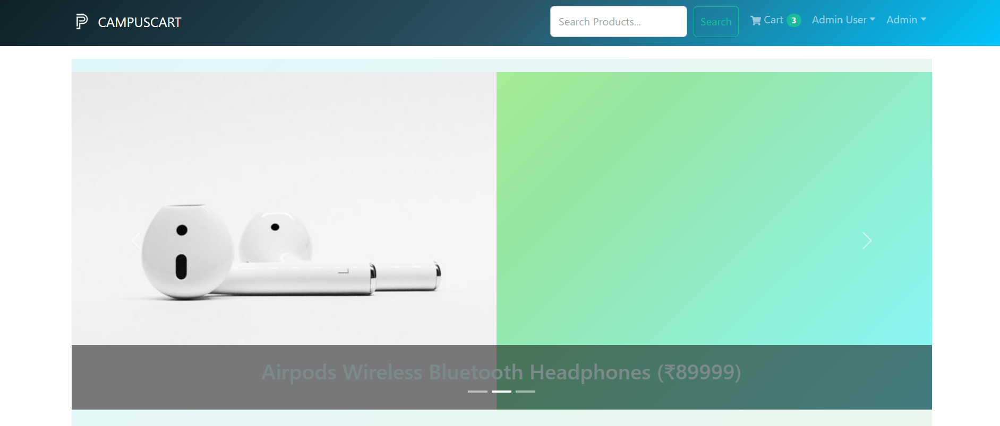
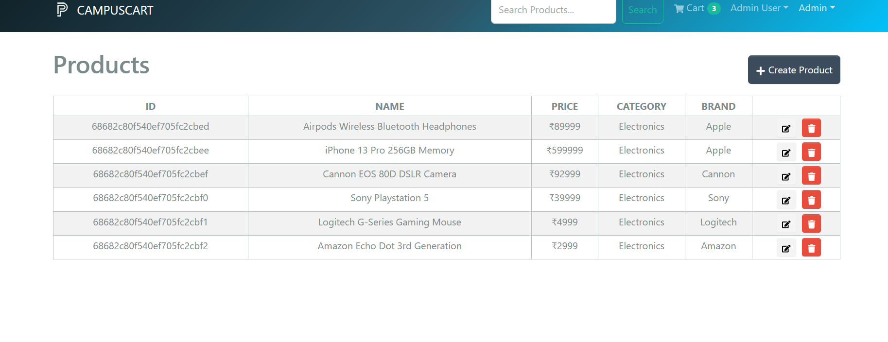
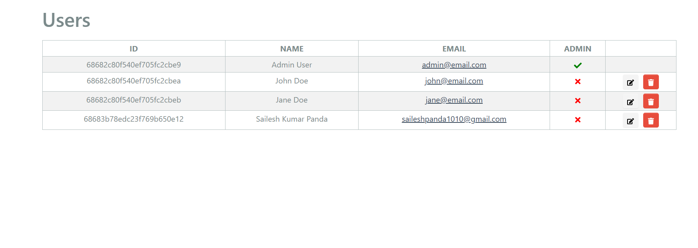
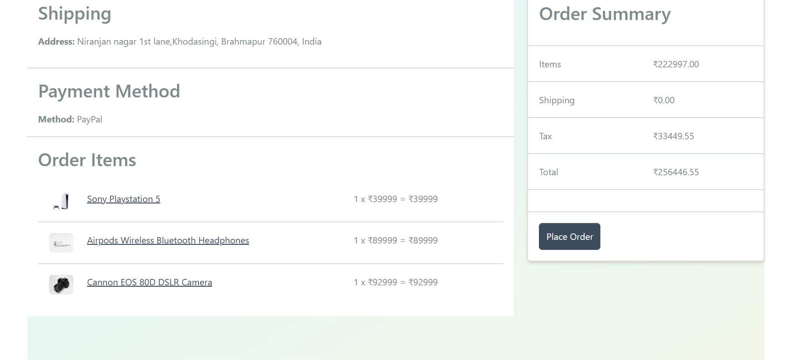

# Campus Cart 🛒

A full-featured eCommerce platform built with the **MERN stack** and **Redux Toolkit**. Shop, manage your profile, and place orders seamlessly.

## 📸 Screenshots

<p align="center">
  
</p>
<p align="center">
  
</p>
<p align="center">
  
</p>
<p align="center">
  
</p>

## ✨ Features

- Full-featured shopping cart with checkout flow
- User authentication & profile management
- Admin dashboard to manage products, orders, and users
- Product ratings & reviews
- Product search, pagination, and category filtering
- PayPal & credit/debit card payments
- Order management with delivery status
- Image upload for product images

## 🚀 Getting Started

### 1. Clone the Repository

```bash
git clone https://github.com/yourusername/Campus_cart.git
cd Campus_cart
```

### 2. Install Dependencies

For root & frontend:

```bash
npm install
cd frontend
npm install

```

### 3. Env Variables

Create a `.env` in your root directory and add the following:

```bash
NODE_ENV=development
PORT=5000
MONGO_URI=your_mongodb_connection_uri
JWT_SECRET=your_jwt_secret
PAYPAL_CLIENT_ID=your_paypal_client_id
PAGINATION_LIMIT=8
```

- Replace `your_mongodb_connection_uri` with your actual MongoDB URI.
- Replace `your_jwt_secret` with a strong secret key for JWT signing.
- Replace `your_paypal_client_id` with your PayPal REST API client ID.
- Adjust `PAGINATION_LIMIT` as needed.

### 4. Seed the Database (Optional)

You can add sample products and users with:

```bash
npm run data:import
npm run data:destroy

```

### 5. Run the App

From the root directory, run:

```bash
npm run dev

```

Backend: http://localhost:5000

Frontend: http://localhost:3000

## 6. Technology

- MongoDB
- Express.js
- React.js
- Node.js
- Redux Toolkit & RTK Query
- Bootstrap
- PayPal REST SDK
- Multer
- JWT Authentication

## 7.Sample User Logins

You can use these test users once you seed the database:

```
Admin
Email: admin@email.com
Password: 123456

Customer 1
Email: john@email.com
Password: 123456

Customer 2
Email: jane@email.com
Password: 123456
```

## 8.License

The MIT License

```
MIT License

Copyright (c) 2025 [Sailesh]

Permission is hereby granted, free of charge, to any person obtaining a copy
of this software and associated documentation files (the "Software"), to deal
in the Software without restriction, including without limitation the rights
to use, copy, modify, merge, publish, distribute, sublicense, and/or sell
copies of the Software, and to permit persons to whom the Software is
furnished to do so, subject to the following conditions:


```
